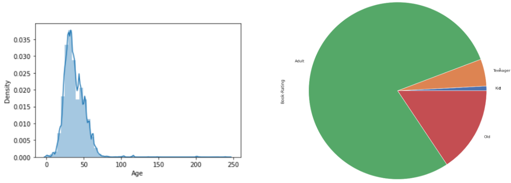

# Book Recommendation System

# Table of Contents

[Objective](#1)

[Team Members](#2)

[Overview](#3)

[Dataset](#4)

- [Data Exploration](#5)

- [Data Preprocessing](#6)

  - [Handling Missing Values](#7)

  - [Combine Title & Author Column](#8)

  - [Get Rid of Duplication](#9)

  - [Merge all Datasets](#10)

  - [Clean and Fix Inconsistent Data](#11)

  - [Optimum Book Reader](#12)

[Feature Engineering](#13)

- [Extract Country Names](#14)

- [Creating Bins for Age Column](#15)

- [Rating Count and Mean](#16)

- [IMDB Weighted Rating](#17)

[Data Analysis & Visualization](#18)

- [Explicit and Implicit Ratings](#19)

- [Location](#20)

- [Author VS Ratings](#21)

- [Book Ratings Counts](#22)

- [Age Distribution of Users](#23)

[Modelling](#24)

- [Content Based](#25)

  - [Google API](#26)

  - [Recommendation Results](#27)

[Collaborative Filtering](#28)

- [Memory Based](#29)

- [Model Based](#30)

  - [Matrix Factorization Based](#31)

  - [Clustering Based](#32)

  - [Other Algorithms](#33)

[Evaluation](#34)

[Error Analysis using Hit Rate](#35)

[Integration with Google Dialogflow](#36)

- [Ngrock](#37)

- [Results](#38)

# <a name ="1">Objective</a>

The project was part of our AI & Data Science Master's degree at the University of Ottawa. 

Kaggle link: [Link](https://www.kaggle.com/code/mostafanofal/book-recommendation-system)

Check all the projects here: [Link](https://github.com/Mostafanofal453)

# <a name = "2">Team Members </a>

[Gehad Hisham](https://www.linkedin.com/in/gehad-hisham/)

[Kareem Bakli](https://www.linkedin.com/in/kareem-bakli-b48228138/)

[Kareem Khaled](https://www.linkedin.com/in/kareemwaly/)

[Mostafa Nofal](https://www.linkedin.com/in/mostafa-nofal-772625194/)

# <a name = "3">Overview</a>

A book recommendation system is a type of recommendation system where we recommend similar books to the reader based on his interest. The books recommendation system is used by online websites which provide eBooks like google play books, open library, good Read’s, etc. recommendation systems ought to increase profit from product sales. To achieve this, recommendations need to be relevant, novel, and diverse.


# <a name = "4">Dataset</a>

**Book Crossing Dataset**

Collected by Cai-Nicolas Ziegler in a 4-week crawl (August / September 2004) from the Book-Crossing community with kind permission from Ron Hornbaker, CTO of Humankind Systems. Contains 278,858 users (anonymized but with demographic information) providing 1,149,780 ratings (explicit / implicit) about 271,379 books.

## <a name="5">Data Exploration</a>

Dataset consists of 3 files:

| BX-Book-Raings                                    | BX-Books                                                     | BX-Book-Users                    |
| ------------------------------------------------- | ------------------------------------------------------------ | -------------------------------- |
| - User-ID <br>- Books ID "ISBN" <br>- Book Rating | - ISBN<br>- Book-Title <br>- Book-Author <br/>- Year of Publication <br/>- Publisher <br/>- Image-URL-S <br/>- Image-URL-M <br/>- Image-URL-L | User-ID <br>- Location <br>- Age |

## <a name="6">Data Preprocessing</a>

### <a name ="7">Handling Missing Values</a>

- We searched for the null and missing values in the whole dataset then fill the missing values with 'Unknown'
- Handle missing value in Age column with random number between ( mean-standatrddeviation , mean+standard_deviation)

### <a name ="8">Combine Title & Author Column</a>

Define a function to combine two columns namely title and author. 


### <a name ="9">Get Rid of Duplication</a>

 

### <a name ="10">Merge all Datasets</a>

 

### <a name ="11">Clean and Fix Inconsistent Data</a>


### <a name ="12">Optimum Book Reader</a>

- We can't take every user's rating at face value because if the user is a novice reader with only an experience of reading a couple of books, his/her ratings might not be much relevant for finding similarity among books.
- Therefore as a general rule of thumb we choosing only those User's who have rated at least 10 Books for building the recommendation system we consider it as innovative work.

```python
counts1 = df_merged_updated['User-ID'].value_counts()

df_merged_updated= df_merged_updated[df_merged_updated['User-ID'].isin(counts1[counts1 >=10].index)].reset_index()
df_merged_updated.drop(columns='index', inplace=True)
```

# <a name = "13">Feature Engineering</a>

## <a name ="14">Extract Country Names</a>


## <a name ="15">Creating Bins for Age Column</a>


## <a name ="16">Rating Count and Mean</a>

Calculating the Rating Count and Rating Mean for each Book-Title


## <a name ="17">IMDB Weighted Rating</a>

Using IMDB Formula to calculate the Weighted Rating for our books using Rating count and Rating Mean that calculated to calculate Weighted Average.


TF-IDF for Description Data

```python
tfidf = TfidfVectorizer(min_df=5)
tfidf_mat = tfidf.fit_transform(df_descriptions['description'])
tfidf_mat
```

# <a name ="18">Data Analysis & Visualization</a>

## <a name ="19">Explicit and Implicit Ratings</a>

Splitting the Dataset into Two Based on the Explicit and Implicit Ratings

<br>

In the first photo we have the dataset with both explicit and implicit ratings is highly skewed toward the value of zero. Implicit means that it contains zero ratings. In the explicit ratings only, the skewness perishes after we remove the implicit ratings.


## <a name ="20">Location</a>

- Most customers are from United states of America, followed by Canada, United Kingdom and Germany. 
- Countries with less than 1% customers are labeled as other.


## <a name ="21">Author VS Ratings</a>

Here, we can observe the most frequently rated author was Nora Roberts, followed by Stephen King.


## <a name ="22">Book Ratings Counts</a>

For book ratings counts we are able to observe that the most frequently rated books by the users. Most frequently rated book, happens to be Wild Animus.


## <a name ="23">Age Distribution of Users</a>

Most customers are Adults who are between 20 and 50 years. The second most represented age group is for boomers who are older than 50 years.



# <a name ="24">Modelling</a>

## <a name ="25">Content Based</a>

- The algorithm recommends a book that is similar to the reader based on his interest. In simple words, In this algorithm, we try to find finding item look alike. For example, a person likes to watch history movies,so he may like reading history books too because the two items have similar tags
- We used cosine similarity and descriptions of the books were transformed into a keyword-based vector-space representation using Tf-IDF. Then cosine similarity was computed between books. Finally, the calculated distances are used to filter previous recommendations on items for every user in the entire user-item dataset.


### <a name ="26">Google API</a>

In our previous Dataset we didn’t have text description, so we used **Google Books API** to extract description of books based on its ISBN and exported it as csv and this was our output. Then we will merge it with our original dataset which contained the user id and book id and consider this as initiative part to transform data from can’t apply content based on to can apply


### <a name ="27">Recommendation Results</a>

```python
#Recommendations based on -> 0749322179: Died in the Wool
recommendations('0749322179')   

""" Output:
['Waltz in Time (An Avon Romantic Treasure)',
 'Pressure Points',
 'Dead Duck (Sam and Hollis Mystery)',
 'Burn Factor',
 'MARRANOS',
 '21st Century Guide to Increasing Your Reading Speed (21st Century Reference)',
 'Barracuda Final Bearing',
 'In the Midnight Hour (Haunting Hearts)',
 "The Year's Best Horror Stories: Series XIV",
 'Most Wanted']
"""
```

Another Example

```python
#Recommendations based on ->0142000892: Miss Julia Takes over
recommendations('2211021662') 

""" Output:
['Burn Factor',
 'Dead Duck (Sam and Hollis Mystery)',
 "The Year's Best Horror Stories: Series XIV",
 'Pressure Points',
 'Most Wanted',
 'In the Midnight Hour (Haunting Hearts)']
"""
```

## <a name ="28">Collaborative Filtering </a>

### <a name ="29">Memory Based</a>

- Memory-Based Collaborative Filtering approaches can be divided into two main sections: user-item filtering and item-item filtering. A user-item filtering takes a particular user, find users that are similar to that user based on similarity of ratings, and recommend items that those similar users liked.


- As you can see, the system has identified users who have a similar preference to the third user, Since the third user has not watched Films 3 and 4, we find the aggregate of ratings of similar users.
- We can understand from the image that Film 4 will be recommended to the user based on historical user data.

### <a name ="30">Model Based</a>

#### <a name ="31">Matrix Factorization Based</a>

- Matrix factorization is a collaborative filtering method to find the relationship between items' and users' entities.
- Its methods are used to find a set of latent factors and determine user preferences using these factors. Latent Information can be reported by analyzing user behavior.
- We use Three Model in Matrix Factorization
  - 1-SVD
  - 2-SVDpp
  - 3-NMF


#### <a name ="32">Clustering Based</a>

- A collaborative filtering algorithm based on co-clustering. 
- This is a straightforward implementation of [George:2005]. Basically, users and items are assigned some clusters Cu, Ci, and some co-clusters. Clusters are assigned using a straightforward optimization method, much like k-means.


#### <a name ="33">Other Algorithms</a>

1. SlopeOne.

2. K-NN Based Algorithms
3. KNN with Means 
4. KNN with ZScore

# <a name ="34">Evaluation</a>

| Algorithm    | RMSE | MAE  |
| ------------ | ---- | ---- |
| SVD          | 0.34 | 0.25 |
| SVDpp        | 0.27 | 0.19 |
| NMF          | 0.15 | 0.09 |
| KNN Basic    | 0.20 | 0.04 |
| KNN Means    | 0.34 | 0.25 |
| KNN ZScore   | 0.36 | 0.26 |
| SlopeOne     | 0.48 | 0.37 |
| CoClustering | 0.67 | 0.56 |

- Comparison of all Algorithms RMSE & MAE Plot


- Our Champion model is KNN Basic with RMSE and MAE are 0.2, 0.04

# <a name ="35">Error Analysis using Hit Rate</a>

- We need to make sure that the results of our recommendation system are related to the original books that our users rated. So first to compute the hit rate, we need to get the top 5 predictions for the users.


- After that we will do cross validation and remove one of the books from the training data. Then we will increase the hit rate by 1 if there is a similarity between the removed item and the predictions. 

- The number of hits divided by the number of test users represents the system's overall hit rate. A higher value indicates better results.
- If we have an extremely low hit rate means that we simply do not have enough data to work with.

# <a name ="36">Integration with Google Dialogflow</a>

## <a name ="37">Ngrock</a>

1. We use AMAN VPN to give us access to use negrock.


2. Use Ngrock to create static IP that Dialog can connect With Dialogflow.


3. Copy Authtoken above to notebook (code).

```python
! ngrok authtoken "2Cg7OGHLAcRtLIdGDI8qt0lnm0T_68QR68P6xf3xDqZApKFij"

"""" Output:
Authtoken saved to configuration file: /root/.ngrok2/ngrok.yml
""""
```

4. After that run this Cell create link paste it to dialog flow fulfillment.

```python
ngrok_tunnel = ngrok.connect(8000)
print('Public URL:', ngrok_tunnel.public_url)
nest_asyncio.apply()
uvicorn.run(app, port=8000)

"""" Output:
Public URL: http://ceee-34-125-4-255.ngrok.io
INFO:     Started server process [59]
INFO:     Waiting for application startup.
INFO:     Application startup complete.
INFO:     Uvicorn running on http://127.0.0.1:8000 (Press CTRL+C to quit)

2313
INFO:     66.249.83.58:0 - "POST / HTTP/1.1" 200 OK

10314
INFO:     66.249.83.208:0 - "POST / HTTP/1.1" 200 OK

INFO:     66.249.83.38:0 - "POST / HTTP/1.1" 200 OK

INFO:     66.249.83.3:0 - "POST / HTTP/1.1" 200 OK
INFO:     Shutting down
INFO:     Waiting for application shutdown.
INFO:     Application shutdown complete.
INFO:     Finished server process [59]
"""""
```

5. Paste Public URL Dialog flow Fulfillment


## <a name ="38">Results</a>

Enter user id in Dialogflow and wait for the recommendation results. 

| user id 10314             | user id 2313              |
| ------------------------- | ------------------------- |
|  |  |
